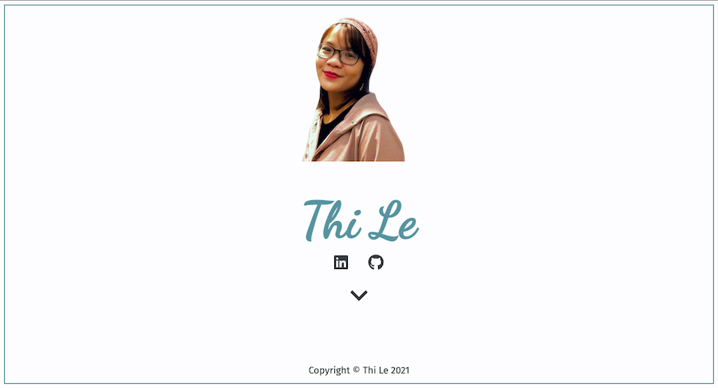
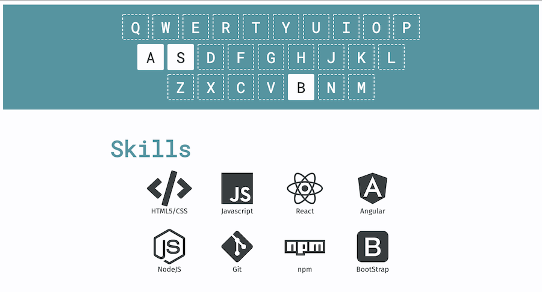

# A Personal Website

[](https://app.netlify.com/sites/thi-lee/deploys)

## Table of contents

- [Overview](#overview)
  - [The challenge](#the-challenge)
  - [Screenshot](#screenshot)
  - [Links](#links)
- [My process](#my-process)
  - [Built with](#built-with)
  - [What I learned](#what-i-learned)
  - [Continued development](#continued-development)
  - [Useful resources](#useful-resources)
- [Author](#author)
- [Acknowledgments](#acknowledgments)

## Overview

### The challenge

- I struggled most with design. I was constantly concerning that my website won't look intuitive or will be hard to navigate.
- As the project grows larger with more routes and components, I need to keep files organized 

### Screenshot




### Links

Live Site URL: [Thi Le](https://dorathilee.netlify.app/)

## My process

### Built with

- Semantic HTML5 markup
- CSS custom properties
- Flexbox
- [React](https://reactjs.org/) - JS library
- [Material-UI]() 

### What I learned

```html
<h1>Some HTML code I'm proud of</h1>
```
```css
.proud-of-this-css {
  color: papayawhip;
}
```
```js
const proudOfThisFunc = () => {
  console.log('🎉')
}
```

### Continued development


### Useful resources

- [Example resource 1](https://www.example.com) – To be worked on
- [Example resource 2](https://www.example.com) - To be done

## Author

- Website - [Thi Le](https://dorathilee.netlify.app/)

## Acknowledgments
